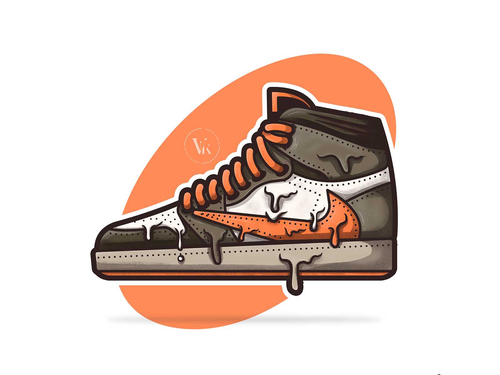
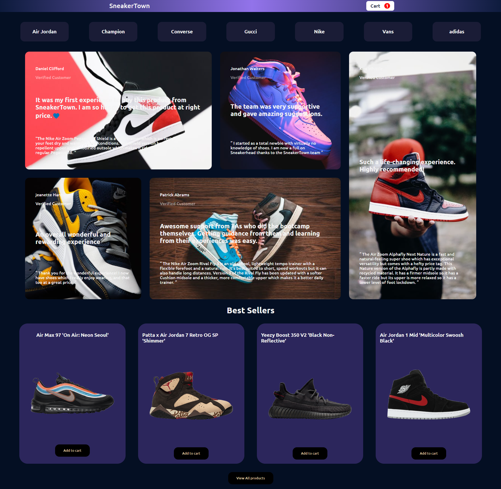
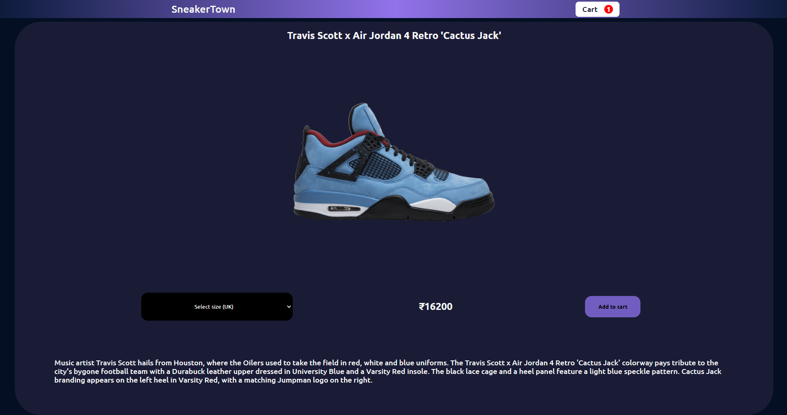
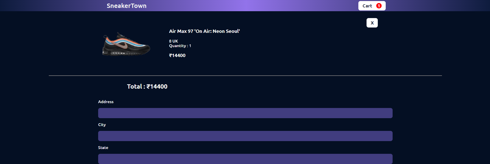

# SneakerTown

A sample ecommerce store built majorly using React js, Redux, Firebase , and React Router.

This project was bootstrapped with [Create React App](https://github.com/facebook/create-react-app).

under construction 🚧

<!--  -->

Currently fixing 🐛's like  

- Pricing part of checkout page
- Cart items's count on navbar
<!-- Home Page

View Sneakers page

View Single sneaker

cart
 -->
